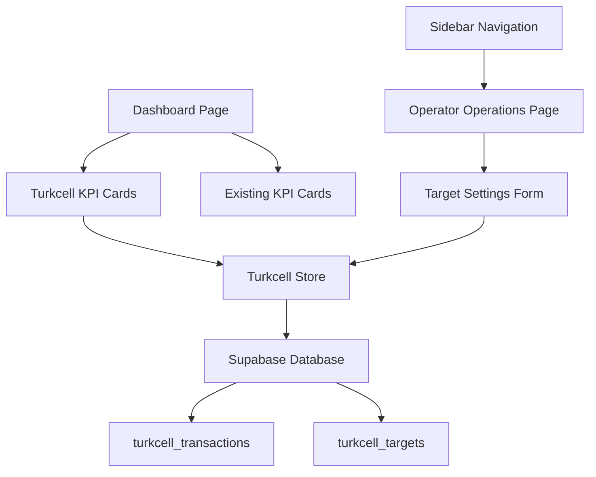

# Design Document

## Overview

Turkcell Dashboard özelliği, mevcut HesapOnda uygulamasına entegre edilecek bir KPI dashboard sistemidir. Bu sistem, günlük Turkcell işlem sayısını ve aylık hedef durumunu görsel olarak sunan iki KPI kartı ile operatör işlemleri yönetimi için sidebar navigasyonu içerecektir.

## Architecture

### High-Level Architecture



### Component Hierarchy

```
DashboardPage
├── Layout
│   ├── Sidebar (updated)
│   │   └── Operatör İşlemleri (new menu item)
│   └── MainContent
│       ├── Existing KPI Cards
│       └── Turkcell KPI Cards (new)
│           ├── TurkcellDailyCard
│           └── TurkcellMonthlyCard
│
OperatorOperationsPage (new)
├── Layout
└── MainContent
    ├── TargetSettingsForm
    └── Other Operator Operations
```

## Components and Interfaces

### 1. Turkcell KPI Cards

#### TurkcellDailyCard Component
```typescript
interface TurkcellDailyCardProps {
  totalToday: number
  loading?: boolean
  error?: string | null
}
```

**Özellikler:**
- Günlük işlem sayısını büyük font ile gösterir
- Smartphone ikonu ile görsel kimlik
- Merkezi hizalama
- Mevcut KPICard bileşenini genişletir

#### TurkcellMonthlyCard Component
```typescript
interface TurkcellMonthlyCardProps {
  monthlyProgress: number
  monthlyTarget: number
  loading?: boolean
  error?: string | null
}
```

**Özellikler:**
- Progress bar ile görsel ilerleme
- Yüzde ve hedef bilgisi
- Target ikonu ile görsel kimlik
- Sol hizalama

### 2. Sidebar Navigation (Updated)

Mevcut `Sidebar.tsx` bileşenine yeni menü öğesi eklenecek:

```typescript
const navItems: NavItem[] = [
  // ... existing items
  {
    title: 'Operatör İşlemleri',
    href: '/operator-operations',
    icon: Settings, // veya uygun bir ikon
    roles: ['admin', 'manager']
  }
]
```

### 3. Operator Operations Page

#### OperatorOperationsPage Component
```typescript
interface OperatorOperationsPageProps {}
```

**Özellikler:**
- Hedef ayarları formu
- Diğer operatör işlemleri için genişletilebilir yapı
- Layout bileşeni ile tutarlı tasarım

#### TargetSettingsForm Component
```typescript
interface TargetSettingsFormProps {
  currentTarget: number
  onTargetUpdate: (newTarget: number) => Promise<void>
  loading?: boolean
}
```

**Özellikler:**
- Mevcut hedefi gösterir
- Yeni hedef girişi için input field
- Form validasyonu (pozitif sayı kontrolü)
- Kaydet butonu ve loading durumu

## Data Models

### Zustand Store: useTurkcellStore

```typescript
interface TurkcellState {
  // Data
  totalToday: number
  monthlyTarget: number
  monthlyProgress: number
  
  // UI State
  loading: boolean
  error: string | null
  
  // Actions
  fetchDailyTransactions: () => Promise<void>
  fetchMonthlyTargets: () => Promise<void>
  updateMonthlyTarget: (target: number) => Promise<void>
  calculateProgress: () => void
  refreshData: () => Promise<void>
}
```

### Database Tables

#### turkcell_transactions
```sql
CREATE TABLE turkcell_transactions (
  id UUID PRIMARY KEY DEFAULT gen_random_uuid(),
  date DATE NOT NULL DEFAULT CURRENT_DATE,
  type VARCHAR(50) NOT NULL,
  count INTEGER NOT NULL DEFAULT 1,
  user_id UUID REFERENCES users(id),
  branch_id UUID REFERENCES branches(id),
  created_at TIMESTAMP WITH TIME ZONE DEFAULT NOW()
);
```

#### turkcell_targets
```sql
CREATE TABLE turkcell_targets (
  id UUID PRIMARY KEY DEFAULT gen_random_uuid(),
  type VARCHAR(50) NOT NULL DEFAULT 'monthly',
  month DATE NOT NULL, -- YYYY-MM-01 format
  target INTEGER NOT NULL,
  user_id UUID REFERENCES users(id),
  branch_id UUID REFERENCES branches(id),
  created_at TIMESTAMP WITH TIME ZONE DEFAULT NOW(),
  updated_at TIMESTAMP WITH TIME ZONE DEFAULT NOW()
);
```

### API Service: turkcellService

```typescript
interface TurkcellService {
  // Daily transactions
  getDailyTransactions(date?: string): Promise<{ total: number }>
  
  // Monthly targets
  getMonthlyTarget(month?: string): Promise<{ target: number }>
  setMonthlyTarget(target: number, month?: string): Promise<void>
  
  // Progress calculation
  getMonthlyProgress(month?: string): Promise<{ 
    progress: number
    total: number
    target: number 
  }>
}
```

## Error Handling

### Error States
1. **Network Errors**: Supabase bağlantı hataları
2. **Data Validation Errors**: Geçersiz hedef değerleri
3. **Permission Errors**: Yetkisiz erişim denemeleri
4. **Loading States**: Veri yüklenirken gösterilecek durumlar

### Error Handling Strategy
```typescript
// Store level error handling
const handleError = (error: Error, context: string) => {
  console.error(`Turkcell ${context} error:`, error)
  set({ 
    error: `${context} sırasında hata oluştu: ${error.message}`,
    loading: false 
  })
}

// Component level error display
const ErrorDisplay = ({ error }: { error: string }) => (
  <div className="text-red-600 text-sm p-2 bg-red-50 rounded">
    {error}
  </div>
)
```

## Testing Strategy

### Unit Tests
- **TurkcellStore**: State management ve API çağrıları
- **TurkcellService**: Database işlemleri
- **Form Validation**: Hedef ayarları form validasyonu

### Integration Tests
- **Dashboard Integration**: KPI kartlarının dashboard'a entegrasyonu
- **Navigation Integration**: Sidebar menü öğesinin çalışması
- **Data Flow**: Store'dan component'lere veri akışı

### Component Tests
- **TurkcellDailyCard**: Farklı veri durumlarında render
- **TurkcellMonthlyCard**: Progress bar hesaplamaları
- **TargetSettingsForm**: Form submit ve validation

## Implementation Details

### File Structure
```
src/
├── components/
│   ├── dashboard/
│   │   ├── TurkcellDailyCard.tsx (new)
│   │   ├── TurkcellMonthlyCard.tsx (new)
│   │   └── index.ts (updated)
│   └── layout/
│       └── Sidebar.tsx (updated)
├── pages/
│   ├── DashboardPage.tsx (updated)
│   └── OperatorOperationsPage.tsx (new)
├── stores/
│   └── turkcellStore.ts (new)
├── services/
│   └── turkcellService.ts (new)
├── hooks/
│   └── useTurkcell.ts (new)
└── types/
    └── turkcell.ts (new)
```

### Styling Guidelines
- **Consistent Design**: Mevcut KPICard bileşeni ile aynı stil
- **Color Scheme**: Primary (#0EA5E9) ve Accent (#2563EB) renkler
- **Typography**: Inter font ailesi
- **Spacing**: 16px padding, 12px border radius
- **Grid Layout**: 4 kolonluk responsive grid

### Performance Considerations
- **Data Caching**: Store seviyesinde veri önbellekleme
- **Lazy Loading**: Operatör işlemleri sayfası için lazy loading
- **Optimistic Updates**: Hedef güncelleme için optimistic UI
- **Error Boundaries**: Component seviyesinde hata yakalama

### Security Considerations
- **Role-based Access**: Operatör işlemleri için admin/manager rolleri
- **Input Validation**: Form girişleri için client ve server validasyonu
- **SQL Injection Prevention**: Parameterized queries kullanımı
- **Branch Isolation**: Multi-tenant yapı için branch_id kontrolü